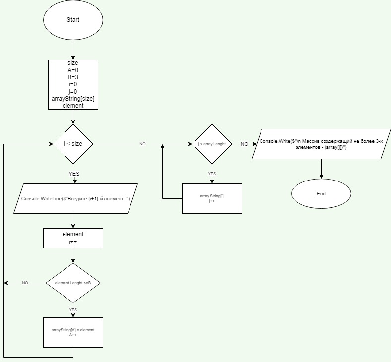

## Задание
Написать программу, которая из имеющегося массива строк формирует массив из строк, длина которых меньше либо равна 3 символа. Первоначальный массив можно ввести с клавиатуры, либо задать на старте выполнения алгоритма. При решение не рекомендуется пользоваться коллекциями, лучше обойтись исключительно массивами.

## Условия выполнения задания
1. Создать репо на GitHub
2. Создать блок-схему 
3. Выложить в репо описание решения (README.md)
4. Написать код, решающий задачу
5. Использовать 4 коммита

## Блок схема
В папке Block находится JPEG с изображением блок-схемы.

## Решение задачи в коде и алгоритм
Указываем количество элементов в массиве. Заполняем изначальный массив элементами, которые пользователь вводит сам. Переведя введенные элементы в массивы, используя метод, проверяем соответствует ли каждый массив количеству необходимых элементов. Выводим в результате только те элементы изначального массива, которые соответствуют условиям задачи.

